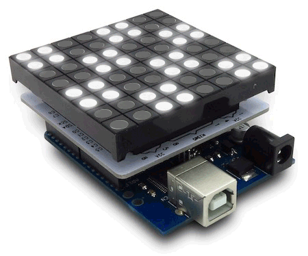

> **i**Racing **F**lashing **L**ight **A**wareness **G**uard

Race marshalling light board for [iRacing.com](http://iracing.com) motorsport simulation.
Arduino-based LED matrix displays racing flags in a truly noticable peripheral vision fashion
making it literally impossible to miss any flag like yellow, blue or safetycar flags.
Additionaly includes optional useful signals like start lights on the grid and more.

Watch [Demonstration youtube video](http://youtu.be/n8sdxkuALDg)
and see [iRacing.com Forum Thread](http://members.iracing.com/jforum/posts/list/0/3341549.page) for more.

Getting Started
---------------

_iFLAG_ software is __gratis__, you just [get the __Hardware__](hardware) and [install the __Software__](software), in this order.

License
-------

[Free open source](LICENSE), enjoy!

- THIS SOFTWARE IS PROVIDED AS IS AND WITH __NO WARRANTY__.
- Author can not be held responsible for any case of hardware issues or possible damage caused by improper usage or by not following these instructions.

Thanks To
---------

Andy Morgan and Rich Jamison for help with track testing, iRacing's David Tucker for his technical expertise and Steve Myers for his encouragement and all iRacing members for support.

---
© 2015-2019
[Petr.Vostřel.cz](http://petr.vostrel.cz),
[simracer.cz](http://simracer.cz)