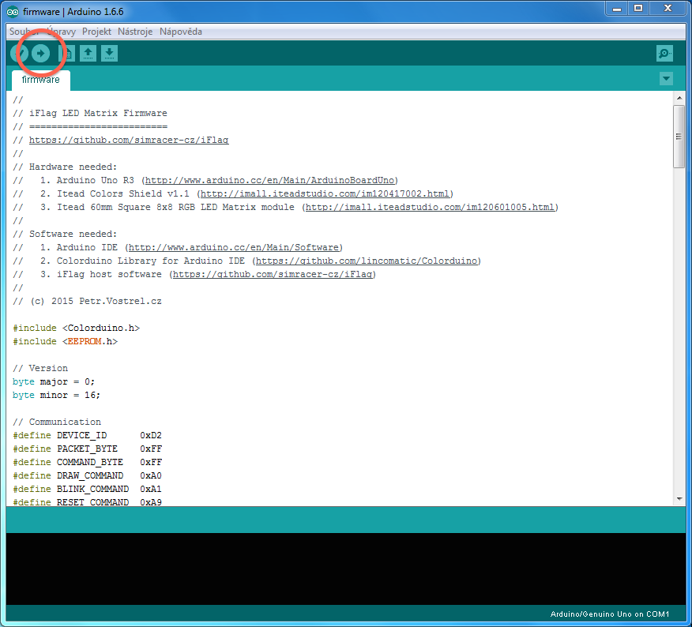

iFlag Firmware
==============

	v0.16

To activate the Arduino board, you will need to use Arduino IDE to compile the firmware and flash the Arduino UNO's memory with it, so that the blank generic board becomes an _iFlag_ board capable of displaying instructions send to it.

1. Install __Arduino IDE__
  - Get it from [ https://www.arduino.cc/en/Main/Software ](https://www.arduino.cc/en/Main/Software). It's free!
  - Run the installer and follow its instructions and confirm installation of every device driver it prompts to.
  - Open `firmware.ino` in the installed IDE.
2. Install __Colorduino Library__
  - Get it in `firmware/libraries/Colorduino`.
  - Choose _"Add Library"_ from _Sketch_ > _Import Library_ menu of the IDE.
  - Select `Colorduino` folder and hit OK.
4. Connect the Arduino board to the USB port.
  - Choose _"Arduino UNO"_ from _Tools_ > _Board_ menu of the IDE.
  - Choose the actual port from _Tools_ > _Port_ menu of the IDE.
5. Click on _"Upload"_ button in the IDE toolbar on the top (it's the second from the left).

These steps will cause the source code to compile and get uploaded to the Arduino board which will permanently flash its memory with it.

Self Test
---------

After you've successfully completed these steps, you should see a self test routine running every time you plug in (or reset) the board. The routine is there to test out the individual LED chips of the matrix allowing you to inspect and asses the condition of your matrix. The firmware will briefly light up two of the three color chips inside each LED at the same time, which results in the matrix lighting up with solid pink, teal and cyan colors in close succession.

	VIDEO

Next Step
---------

With the device alive the next step is to copy [ _iFlag_ Software ](../software) to your computer and run it.

---
© 2015
[ Petr.Vostřel.cz ](http://petr.vostrel.cz),
[ simracer.cz ](http://simracer.cz),
[ 4xracing.co.uk ](http://4xracing.co.uk)

