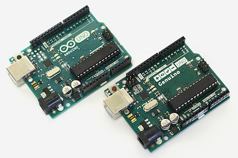
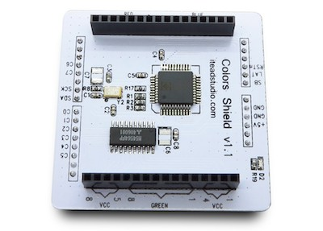
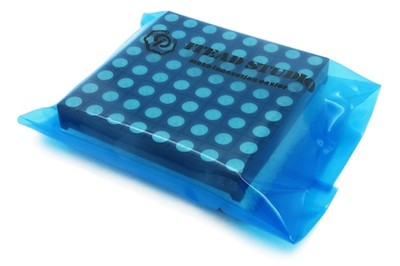
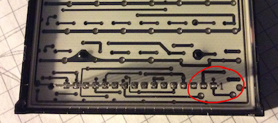
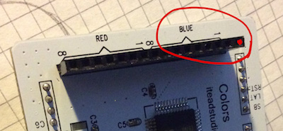
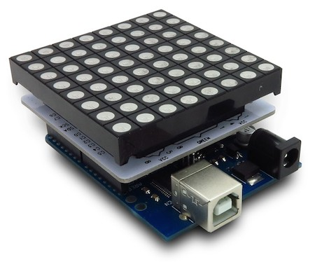
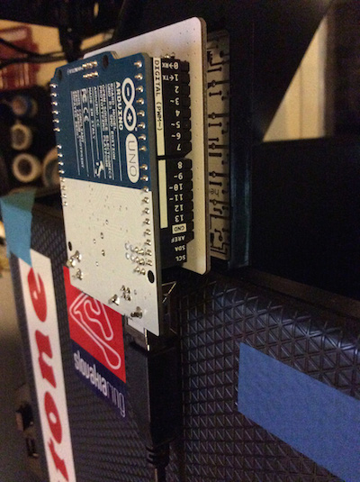
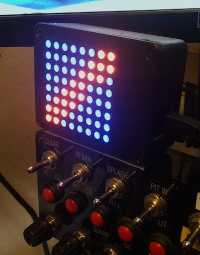

The Hardware
============

	v1

_iFlag_ hardware-wise consists of three individual components, all of them also open source.
You should be able to source these parts locally, the following links are only illustrational.
All three will cost you somewhere around $50 or $60 total.

## A. [__Arduino UNO__ compatible board](https://www.arduino.cc/en/Main/ArduinoBoardUno)

> Arduino is an open-source computer hardware and software company, project and user community that designs and manufactures microcontroller-based kits for building digital devices and interactive objects that can sense and control the physical world.

> Arduino boards are available commercially in preassembled form, or as do-it-yourself kits. The hardware design specifications are openly available, allowing the Arduino boards to be manufactured by anyone.

-- [Wikipedia](https://en.wikipedia.org/wiki/Arduino)

## B. [__Colors Shield__ by Itead](http://www.itead.cc/itead-colors-shield.html)

## C. [__60mm 8x8 LED Matrix__ by Itead](http://www.itead.cc/60mm-square-8-8-led-matrix-rgb-circle-dot.html)

Assembly Instructions
---------------------

The construction is pretty straightforward as it is basically a sandwitch of the three components with the Colors Shield in between Arduino and the LED matrix unit. Slide the bare "legs" of one part into respective connectors of the other part and let the printed labels on all components guide you.

__Beware!__ While connecting Arduino and the Colors Shield "backwards" is nearly impossible thanks to Arduino's
clever pinning, connecting the LED matrix backwards is absolutely possible. Pay good attention to aligning pin `1` on the LED matrix:

with pin `1` on the Color shield:

Assembled unit will look like this:

Connection
----------

Use regular USB cable to connect the _iFlag_ device to your computer. This cable will provide data as well as more than enough power to the flag and it is the only required cable you really need. You do not need any external power supply. But you definitely can use one, with proper rating for your Arduino board (usually 7V - 9V).

Mounting
--------

The assembled unit can be mount in any orientation you like, there is no "up" (actually you can choose where up is in the software later). Easiest is to simply let it rest on top of your screen with the USB cable hanging straight down supporting it eventually secure it with a bit of double sided sticky tape or a velcro.

You can also put the unit into an enclosure of your choice.

Or buy a [FiTECH](http://www.fi-tech.net) enclosure from Carsten Filmer.

---
© 2015-2016
[Petr.Vostřel.cz](http://petr.vostrel.cz),
[simracer.cz](http://simracer.cz),
[4xracing.co.uk](http://4xracing.co.uk)

