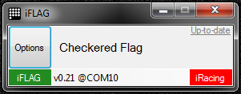

iFlag Software
==============

	v0.58

_iFlag_ software translates provides the interconnection of iRacing and the matrix. It continuously listens for iRacing session and other signals, processes them and issues commands telling the device exactly what to display
on the LED matrix.

So far _iFlag_ doesn't come with any installer, it is only an EXE you run.

__Copy the `software/iFlag` folder to anywhere you like on your harddrive, except Program Files folder(s), and run it from there.__ It is useful to make a shortcut in Startup items to have iFlag ready as soon as you start the computer.

_iFlag_ requires .NET Framework 4 installed on your computer. Get it for free from [Microsoft](https://www.microsoft.com/en-us/download/details.aspx?id=17718).

* __Options__ button lets you specify a few _iFlag_ settings explained further.
* __"White flag"__ is the name of the currently shown flag/signal.
* __Matrix__ visually indicates USB device connection status, green being connected and red otherwise, with connection details (device firmware version and port) to the right of it
* __iRacing__ visually indicates running iRacing session, green with iRacing launched and red otherwise.

Operating Instructions
----------------------

_iFlag_ will scan for the LED matrix hardware (this may take a few seconds). Once it is found, the red indicator labeled "Matrix" in the lower left corner will turn green to indicate the hardware readiness and that you are ready to run.

Options
-------

### USB Connector

Since the LED matrix is totally symetrical it allows to be mounted in four different functionally identical orientations with the Arduino's USB connector pointing either __Up__, __Left__, __Right__ or __Down__. Once you choose one of the four options from this option's submenu, a flag will light up momentarily with a letter "F" on it letting you to verify that visuals showed by your device will be correctly upright.

### Flag Modules

The visual features of _iFlag_ are coupled into modules, which can be turned on and off individually inside this option submenu.

* __Racing Flags__ - currently capable of reacting to iRacing session flag changes and displaying 14 different racing flags. This set is mandatory and can not be turned off.
* __Start Lights__ - starting procedure lights. Optional.
* (__Pit Signals__) - coming soon...

### Demo Mode

When not inside iRacing session, _iFlag_ can either light down and silently wait for the next session or it can cycle through a demo sequence showcasing a subset of its flag signals. As this feature is flashy, you may become annoying, so you can switch it off eventually.

### Always On Top

As usual. Whether to keep the window on top of all other windows.

Next Step
---------

Well, that's it, there is no next step! Go enjoy your brand new _iFlag_ light panel :)

---
© 2015
[Petr.Vostřel.cz](http://petr.vostrel.cz),
[simracer.cz](http://simracer.cz),
[4xracing.co.uk](http://4xracing.co.uk)

