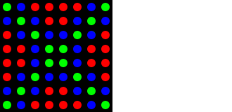
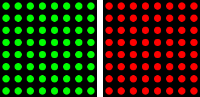
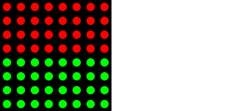
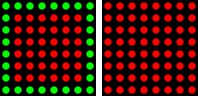
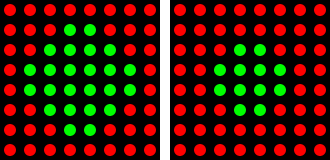
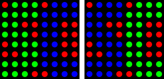
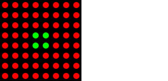
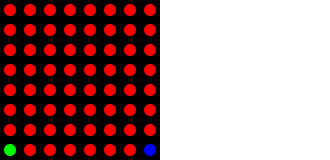
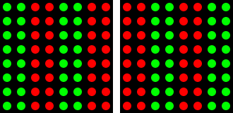
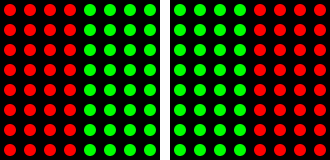

Patterns
========
_as defined in [patterns.cs](../iFlag/patterns.cs)_

A complete alphabetical list of patterns, which get conbined with color index information and timing to form a [visual signal](Signals.md).
Many of them are capable of more than they are used for and there are also few patterns, which are currently not being used at all.

Mechanics
---------

Each pattern is made out of color indexes referring to the `color` array the actual flag uses in the `flag()` call.
This allows for reuse of the patterns and while many are unique to some flags, some of the more trivial ones are being used by multiple signals at once.

Color Legend
------------

Frame Color | Index in `flag()`'s `color` Array
----------- | ---------------------------------
Red         | `0`
Green       | `1`
Blue        | `2`
Yellow      | `3`
Cyan        | `4` (N/A)
Magenta     | `5` (N/A)

\* Not used yet

Pattern Frames
--------------

| Pattern                   | Frames                                | Used For |
| ------------------------- | --------------------------------------| ------- |
| `CHECKERED_FLAG`          |            | Checkered flag |
| `CROSSED_FLAG`            |              | Disqualified |
| `DIAGONAL_STRIPE_FLAG`    |      | Blue flag |
| `DOUBLE_WAVING_FLAG`      |        | (N/A) |
| `F_FLAG`                  |                    | Greeting, Orientation check pattern |
| `FLASHING_FLAG`           |             | Red flag, Full course caution (oval) |
| `FURLED_FLAG`             |               | Furled black flag |
| `HALF_FLAG`               |                 | Start lights: Ready! |
| `INVERTED_FLAG`           |             | Black flag, One lap to green |
| `IRACING_LOGO_FLAG`       |              | (N/A) |
| `MEATBALL_FLAG`           |             | Meat ball flag |
| `SC_FLAG`                 |                   | Full course caution (road) |
| `SIMPLE_FLAG`             |               | White flag, Start lights: Set!, All green flags |
| `STATUS_FLAG`             |               | (N/A) |
| `STRIPPED_FLAG`           |             | Debris flag |
| `WAVING_FLAG`             |               | Yellow flag |

---
© 2015-2016
[Petr.Vostřel.cz](http://petr.vostrel.cz),
[simracer.cz](http://simracer.cz),
[4xracing.co.uk](http://4xracing.co.uk)
