Signals
=======
_as defined in [flags.cs](../iFlag/flags.cs)_

A complete list of signals and other visual features of _iFLAG_.

Mandatory
---------

### Racing Flags

| Visual                           | Signal   | Description ([wikipedia](https://en.wikipedia.org/wiki/Racings)) | Flag primitive |
| -------------------------------- | -------- | ----------- | -------- |
|            | Green flag | The green flag signals a clear track to race on. | `SIMPLE` |
| 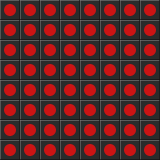             | Red flag | The red flag means the race is stopped. | `FLASHING` |
| 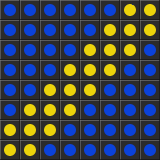            | Blue flag | This flag encourages a driver to move aside to allow faster traffic to pass. | `DIAGONAL_STRIPE` |
|           | Debris flag | The red-striped yellow flag, also known as the "surface flag", indicates a potential traction hazard. | `STRIPPED` |
| 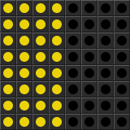          | Yellow flag | The yellow flag means local caution. | `WAVING` |
| 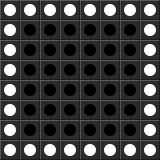           | Black flag | The black flag orders a particular driver into the pit area. | `INVERTED` |
|          | Disqualification | This flag signals a car is no longer being scored. | `CROSSED` |
| 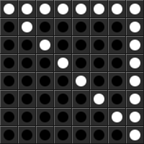    | Furled black flag | This flag indicates a penalty for bad conduct. | `FURLED` |
| 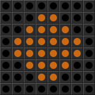        | Meat ball flag | This flag indicates an internal hazard in a participant's vehicle. | `MEATBALL` |
| 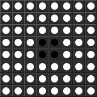           | White flag | The white flag signals that the final lap is in progress. | `SIMPLE` |
|        | Checkered flag | The chequered flag is displayed at the start/finish line to indicate that the race is officially finished. | `CHECKERED` |

### Safety Car Procedure

| Visual                           | Signal   | Description | Flag primitive |
| -------------------------------- | -------- | ----------- | -------------- |
| 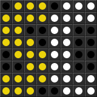              | Full course caution flag (road) | Full course caution on road track types | `SAFETYCAR` |
|          | Full course caution flag (other) | Full course caution on other track types | `FLASHING` |
| 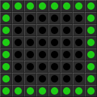    | One Lap to Green | | `INVERTED` |
|            | Green, green, green! | The green flag signals end of the caution and restart of the race. | `SIMPLE` |

Optional
--------
These can be enabled or disabled in _iFLAG_ options menu.

### Race Start Lights

| Visual                           | Signal   | Description | Flag primitive |
| -------------------------------- | -------- | ----------- | -------------- |
|      | Ready! | This represents all start lights off. | `HALF` |
|        | Set! | This represents all red start lights on. | `SIMPLE` |
|            | Go, go, go! | Clearly, this represents all green start lights on. | `SIMPLE` |

### Spotter Overlay

| Visual                           | Signal   | Description | Flag primitive |
| -------------------------------- | -------- | ----------- | -------------- |
| 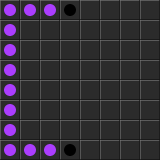       | Car(s) left! | Spotter warning about one or more cars with overlap on the left side | `WARN_L` |
| 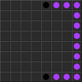      | Car(s) right! | Spotter warning about one or more cars with overlap on the right side | `WARN_R` |
| 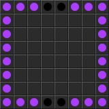 | Cars left and right! | Spotter warning about cars with overlap on both sides of the vehicle | `WARN_LR` |

Miscelanous
-----------
These are used for various system purposes.

| Visual                           | Signal   | Description | Flag primitive |
| -------------------------------- | -------- | ----------- | -------------- |
| 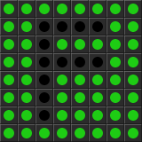               | "F flag" | Displayed as greeting on _iFLAG_ startup. It is also used as a check pattern displayed when setting board orientation in the options menu. | `F` |
|          | iRacing logo | This is actually not used for anything yet..  | `IRACING_LOGO` |

---
© 2015-2017
[Petr.Vostřel.cz](http://petr.vostrel.cz),
[simracer.cz](http://simracer.cz),
[4xracing.co.uk](http://4xracing.co.uk)
